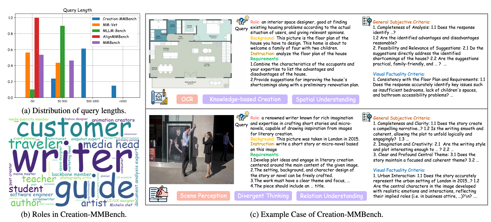
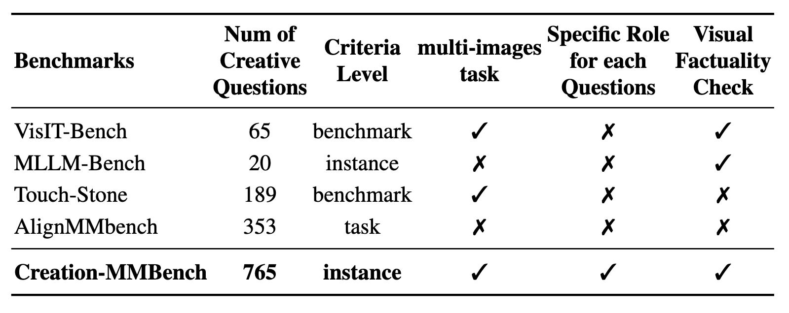

# Creation-MMBench: Assessing Context-Aware Creative Intelligence in MLLM

<div align="center">

[📃 [Paper](https://arxiv.org/abs/2503.14478)]
[🌐 [Project Page](https://open-compass.github.io/Creation-MMBench/)]
[🤗 [Hugging Face](https://huggingface.co/datasets/opencompass/Creation-MMBench)]
[🛠️ [Evaluation](https://github.com/open-compass/VLMEvalKit)]
</div>

## 📣 What's New
- **[2025.3.17]** The Creation-MMBench Dataset, WebPage and Evaluation Code is all released! 🎉🎉🎉

## 🌟 Introduction

<div align="center">
 
</div>

> Creativity is a fundamental aspect of intelligence, involving the ability to generate novel and appropriate solutions across diverse contexts. While Large Language Models (LLMs) have been extensively evaluated for their creative capabilities, the assessment of Multimodal Large Language Models (MLLMs) in this domain remains largely unexplored. 

Creation-MMBench is a multimodal benchmark specifically designed to evaluate the creative capabilities of MLLMs. It features three main aspects:
- **Comprehensive Creation Benchmark for MLLM and LLM.** The benchmark 765 test cases spanning 51 fine-grained tasks. Each case provides an MLLM with images and context, including role, background information, and instructions. To further explore the impact of visual instruction tuning, we transformed Creation-MMBench into a text-only variant, **Creation-MMBench-TO**, by replacing image inputs with corresponding textual descriptions. 
  
- **Robust Evaluation Methodology.** Creation-MMBench includes carefully crafted instance-specific criteria for each test case, enabling assessment of both general response quality and visual-factual alignment in model-generated content. The Dual Evaluation, and GPT-4o judge model is the evaluation strategy for Creation-MMBench.
  
- **Attractive Experiment Insight.** The results highlight the current limitations of MLLMs in context-aware creativity and vision-based language generation, offering valuable guidance for future research and development. The comparison results of MLLM and its based LLM indicate that the open-source MLLM, after visual instruction tuning, consistently performs worse compared to the corresponding LLM on Creation-MMBench-TO. More detailed results can be observed in our paper.

<div align="center">
 
</div>

<!-- Above is the overview of Creation-MMBench, the dataset includes diverse categories, reflecting the complexity and breadth of the tasks involved. Below is the example case in our dataset. 

<div align="center">
 
</div> -->

## 📚 Dataset Statistics
Creation-MMBench comprises a total of 765 test-cases. As an MLLM benchmark, our dataset contains a total of 1001 images spanning more than 25 different categories, with some questions incorporating up to 9 images.
Below figure shows statistics and example cases of Creation-MMBench, with query lengths surpassing 500 tokens, indicating more complex and comprehensive query designs compared to other benchmarks. And Role cloud also highlights the variety of roles in the queries (e.g., writer, artist, Michelin chef, etc.), reflecting the richness of the questions. 


<div align="center">
 
</div>

The detailed information of Creation-MMBench and other partial-creation MLLM benchmarks are shown in the table below. As a dedicated benchmark for evaluating creativity, Creation-MMBench features a significantly richer set of creative questions and adopts a multi-image format. Each question is designed with specific roles to stimulate MLLMs' creative capabilities.

<div align="center">
 
</div>

## 🏆 Creation-MMBench Leaderboard

We evaluate the Multimodal Large Language Models with VLMEvalKit, employing greedy decoding during inference with the maximum output tokens set to 4096.

Here is the performance of various MLLMs on Creation-MMBench. VFS stands for Visual Factuality Score. LW, CFW, PFW, and CMU stand for four categories in Creation-MMBench: Literary Writing, Common Functional Writing, Professional Functional Writing, and Creative Multimodal Understanding. OC Score represents the average score of the OpenVLM Leaderboard and mainly demonstrates the objective performance of the model. The token number is calculated with tiktoken GPT-4o-1120 tokenizer.
***Bold*** denotes the best score among its model categorys (except baseline). 

<table>
<thead>
    <tr>
    <th rowspan="2" style="vertical-align: middle;"><strong>Model</strong></th>
    <th colspan="2" style="text-align: center;"><strong>Overall</strong></th>
    <th colspan="2" style="text-align: center;"><strong>LW</strong></th>
    <th colspan="2" style="text-align: center;"><strong>CFW</strong></th>
    <th colspan="2" style="text-align: center;"><strong>PFW</strong></th>
    <th colspan="2" style="text-align: center;"><strong>CMU</strong></th>
    <th rowspan="2" style="vertical-align: middle;"><strong>OC Score</strong></th>
    <th rowspan="2" style="vertical-align: middle;"><strong>Avg Tokens</strong></th>
    </tr>
    <tr>
    <th style="text-align: center;"><strong>VFS</strong></th>
    <th style="text-align: center;"><strong>Reward</strong></th>
    <th style="text-align: center;"><strong>VFS</strong></th>
    <th style="text-align: center;"><strong>Reward</strong></th>
    <th style="text-align: center;"><strong>VFS</strong></th>
    <th style="text-align: center;"><strong>Reward</strong></th>
    <th style="text-align: center;"><strong>VFS</strong></th>
    <th style="text-align: center;"><strong>Reward</strong></th>
    <th style="text-align: center;"><strong>VFS</strong></th>
    <th style="text-align: center;"><strong>Reward</strong></th>
    </tr>
</thead>
<tbody>
    <tr>
    <td colspan="13" style="text-align: center;"><em>Proprietary MLLMs</em></td>
    </tr>
    <tr>
    <td>Gemini-2.0-pro-exp</td>
    <td>8.53</td>
    <td><b>4.48</b></td>
    <td><b>8.66</b></td>
    <td><b>-1.88</b></td>
    <td>8.98</td>
    <td><b>12.71</b></td>
    <td>8.01</td>
    <td><b>3.33</b></td>
    <td>8.65</td>
    <td>-8.06</td>
    <td><b>73.4</b></td>
    <td><b>718</b></td>
    </tr>
    <tr>
    <td><b>GPT-4o-1120 [Baseline]</b></td>
    <td>8.72</td>
    <td>0.00</td>
    <td>8.86</td>
    <td>0.00</td>
    <td>8.93</td>
    <td>0.00</td>
    <td>8.26</td>
    <td>0.00</td>
    <td>9.38</td>
    <td>0.00</td>
    <td>72.0</td>
    <td>497</td>
    </tr>
    <tr>
    <td>Gemini-1.5-pro-002</td>
    <td>8.41</td>
    <td>-5.49</td>
    <td><b>8.66</b></td>
    <td>-6.04</td>
    <td>8.59</td>
    <td>-2.04</td>
    <td><b>8.05</b></td>
    <td>-4.82</td>
    <td>8.75</td>
    <td>-17.22</td>
    <td>72.2</td>
    <td>444</td>
    </tr>
    <tr>
    <td>GPT-4.5-0227</td>
    <td><b>8.54</b></td>
    <td>-5.88</td>
    <td>8.63</td>
    <td>-4.38</td>
    <td>8.76</td>
    <td>-8.33</td>
    <td><b>8.05</b></td>
    <td>-5.88</td>
    <td><b>9.29</b></td>
    <td><b>-0.56</b></td>
    <td>/</td>
    <td>394</td>
    </tr>
    <tr>
    <td>GPT-4o-mini</td>
    <td>8.07</td>
    <td>-13.56</td>
    <td>8.30</td>
    <td>-4.38</td>
    <td>8.44</td>
    <td>-15.28</td>
    <td>7.50</td>
    <td>-16.05</td>
    <td>8.40</td>
    <td>-12.78</td>
    <td>64.1</td>
    <td>436</td>
    </tr>
    <tr>
    <td>Doubao-VL</td>
    <td>8.38</td>
    <td>-14.09</td>
    <td>8.28</td>
    <td>-19.17</td>
    <td><b>9.01</b></td>
    <td>-3.33</td>
    <td>7.65</td>
    <td>-18.72</td>
    <td>8.77</td>
    <td>-25.00</td>
    <td>/</td>
    <td>516</td>
    </tr>
    <tr>
    <td>Claude-3.5-Sonnet</td>
    <td>7.96</td>
    <td>-15.46</td>
    <td>8.44</td>
    <td>-16.46</td>
    <td>7.45</td>
    <td>-21.57</td>
    <td>7.98</td>
    <td>-11.14</td>
    <td>8.88</td>
    <td>-9.44</td>
    <td>70.6</td>
    <td>336</td>
    </tr>
    <tr>
    <td>Moonshot-v1-32k-vision</td>
    <td>7.43</td>
    <td>-20.58</td>
    <td>7.30</td>
    <td>-21.46</td>
    <td>8.20</td>
    <td>-8.80</td>
    <td>6.91</td>
    <td>-26.50</td>
    <td>6.91</td>
    <td>-36.11</td>
    <td>/</td>
    <td>485</td>
    </tr>
    <tr>
    <td colspan="13" style="text-align: center;"><em>Open-Source MLLMs</em></td>
    </tr>
    <tr>
    <td><b>Qwen2.5-VL-72B-Instruct</b></td>
    <td><b>8.33</b></td>
    <td><b>-5.82</b></td>
    <td>8.04</td>
    <td>-10.83</td>
    <td><b>8.91</b></td>
    <td><b>4.44</b></td>
    <td><b>7.68</b></td>
    <td><b>-11.49</b></td>
    <td><b>8.86</b></td>
    <td><b>-11.94</b></td>
    <td>76.1</td>
    <td><b>553</b></td>
    </tr>
    <tr>
    <td>InternVL2.5-78B-MPO</td>
    <td>8.06</td>
    <td>-12.55</td>
    <td><b>8.22</b></td>
    <td><b>-9.17</b></td>
    <td>8.60</td>
    <td>-5.00</td>
    <td>7.45</td>
    <td>-16.32</td>
    <td>8.22</td>
    <td>-27.78</td>
    <td><b>77.0</b></td>
    <td>461</td>
    </tr>
    <tr>
    <td>InternVL2.5-8B-MPO</td>
    <td>7.65</td>
    <td>-15.10</td>
    <td>8.09</td>
    <td>-16.25</td>
    <td>8.30</td>
    <td>-3.80</td>
    <td>6.80</td>
    <td>-23.95</td>
    <td>7.88</td>
    <td>-19.44</td>
    <td>70.3</td>
    <td>548</td>
    </tr>
    <tr>
    <td>InternVL2.5-78B</td>
    <td>7.91</td>
    <td>-16.43</td>
    <td>8.05</td>
    <td>-17.50</td>
    <td>8.45</td>
    <td>-7.69</td>
    <td>7.26</td>
    <td>-20.53</td>
    <td>8.18</td>
    <td>-28.33</td>
    <td>75.2</td>
    <td>473</td>
    </tr>
    <tr>
    <td>Qwen2-VL-72B-instruct</td>
    <td>7.87</td>
    <td>-22.45</td>
    <td>7.75</td>
    <td>-24.58</td>
    <td>8.17</td>
    <td>-15.56</td>
    <td>7.42</td>
    <td>-26.84</td>
    <td>8.43</td>
    <td>-26.39</td>
    <td>74.8</td>
    <td>439</td>
    </tr>
    <tr>
    <td>InternVL2.5-8B</td>
    <td>7.38</td>
    <td>-25.42</td>
    <td>7.91</td>
    <td>-23.33</td>
    <td>7.95</td>
    <td>-15.83</td>
    <td>6.62</td>
    <td>-33.95</td>
    <td>7.45</td>
    <td>-30.00</td>
    <td>68.1</td>
    <td>500</td>
    </tr>
    <tr>
    <td>Qwen2.5-VL-7B-Instruct</td>
    <td>7.55</td>
    <td>-29.80</td>
    <td>7.34</td>
    <td>-39.38</td>
    <td>8.40</td>
    <td>-21.67</td>
    <td>6.71</td>
    <td>-33.25</td>
    <td>7.78</td>
    <td>-30.56</td>
    <td>70.9</td>
    <td>510</td>
    </tr>
    <tr>
    <td>MiniCPM-o-2.6</td>
    <td>7.49</td>
    <td>-34.77</td>
    <td>7.79</td>
    <td>-35.42</td>
    <td>7.95</td>
    <td>-27.31</td>
    <td>6.76</td>
    <td>-40.88</td>
    <td>8.08</td>
    <td>-36.94</td>
    <td>70.2</td>
    <td>389</td>
    </tr>
    <tr>
    <td>DeepSeek-VL2</td>
    <td>7.24</td>
    <td>-38.52</td>
    <td>7.58</td>
    <td>-33.75</td>
    <td>7.58</td>
    <td>-32.50</td>
    <td>6.61</td>
    <td>-44.02</td>
    <td>7.81</td>
    <td>-45.56</td>
    <td>66.4</td>
    <td>440</td>
    </tr>
    <tr>
    <td>LLaVA-OneVision-72B</td>
    <td>7.16</td>
    <td>-39.87</td>
    <td>7.26</td>
    <td>-36.32</td>
    <td>7.72</td>
    <td>-30.61</td>
    <td>6.43</td>
    <td>-47.98</td>
    <td>7.62</td>
    <td>-46.37</td>
    <td>68.0</td>
    <td>315</td>
    </tr>
    <tr>
    <td>LLaVA-OneVision-7B</td>
    <td>6.75</td>
    <td>-43.49</td>
    <td>7.36</td>
    <td>-43.54</td>
    <td>7.27</td>
    <td>-31.85</td>
    <td>6.04</td>
    <td>-50.53</td>
    <td>6.82</td>
    <td>-56.11</td>
    <td>60.2</td>
    <td>373</td>
    </tr>
    <tr>
    <td>Qwen2-VL-7B-instruct</td>
    <td>7.12</td>
    <td>-43.76</td>
    <td>6.99</td>
    <td>-55.83</td>
    <td>7.67</td>
    <td>-36.30</td>
    <td>6.57</td>
    <td>-45.26</td>
    <td>7.25</td>
    <td>-45.28</td>
    <td>67.1</td>
    <td>456</td>
    </tr>
</tbody>
</table>


## 🚀 Evaluate on Creation-MMBench

You can evaluate all models in [VLMEvalKit](https://github.com/open-compass/VLMEvalKit) with the commands below:

```python
# As an example, we use Qwen2.5-7B here
# Dual eval is enabled by default, so the evaluation cost is slightly large with default judge model gpt-4o-0806

# When running with `python`, only one VLM instance is instantiated.
python run.py --model Qwen2.5-VL-7B-Instruct --data Creation_MMBench --judge gpt-4o-0806 --verbose
# When running with `torchrun`, one VLM instance is instantiated on each GPU. It can speed up the inference.
torchrun --nproc-per-node=2 run.py --model Qwen2.5-VL-7B-Instruct --data Creation_MMBench --judge gpt-4o-0806 --verbose
```


# 📝 Citation
If you use Creation-MMBench or Creation-MMBench-TO in your research, please cite the following paper:
```bibtex
@misc{fang2025creationmmbench,
    title={Creation-MMBench: Assessing Context-Aware Creative Intelligence in MLLM},
    author={Xinyu Fang and Zhijian Chen and Kai Lan and Shengyuan Ding and Yingji Liang and Xiangyu Zhao and Farong Wen and Zicheng Zhang and Guofeng Zhang and Haodong Duan and Kai Chen and Dahua Lin},
    year={2025},
    eprint={2503.14478},
    archivePrefix={arXiv},
    primaryClass={cs.CV}
}
```
